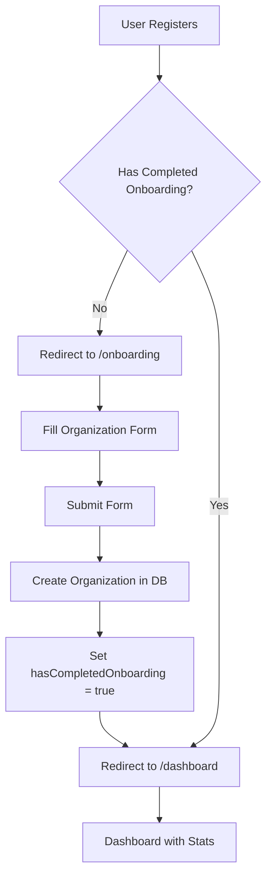

# Organization Onboarding Flow - Implementation Walkthrough

## ✅ What We Built

Successfully implemented the complete organization onboarding flow for the B2B platform.

---

## 🎯 Features Implemented

### 1. Organization Onboarding Page

**File:** [onboarding/page.tsx](file:///d:/evently/app/(protected)/onboarding/page.tsx)

**Features:**
- Welcoming card layout with clear messaging
- Fetches industries from database
- Passes data to organization form
- Redirects to dashboard after completion

**User Experience:**
- Clean, centered card design
- Friendly welcome message
- Clear call-to-action

---

### 2. Updated Organization Form

**File:** [OrganizationForm.tsx](file:///d:/evently/components/shared/OrganizationForm.tsx)

**New Fields Added:**
- ✅ **Industry Selection** - Dropdown with all available industries
- ✅ **Organization Size** - STARTUP, SME, or ENTERPRISE
- ✅ **Location** - City, Country
- ✅ **Description** - Rich text area (optional)
- ✅ **Website** - URL field (optional)
- ✅ **Logo Upload** - File uploader integration

**Improvements:**
- Uses new server actions instead of API routes
- Proper form labels for better UX
- Loading states during submission
- Zod validation with clear error messages
- Success message before redirect
- Disabled state during submission

---

### 3. Middleware Integration

**File:** [middleware.ts](file:///d:/evently/middleware.ts)

**Onboarding Logic:**
1. **Check if user is logged in**
2. **Fetch user from database** to check `hasCompletedOnboarding`
3. **Redirect to `/onboarding`** if not completed
4. **Prevent access to `/onboarding`** if already completed

**Security:**
- Runs on every protected route
- Prevents bypass attempts
- Maintains user flow integrity

---

### 4. Updated Validation Schema

**File:** [validation.ts](file:///d:/evently/lib/validation.ts)

**Changes:**
```typescript
OrganizationCreateSchema:
- name: 2-100 characters (was 3-20)
- industryId: UUID validation (was string)
- description: Optional, 5-500 characters
- website: Optional URL or empty string
- location: Optional, max 100 characters
- size: Enum (STARTUP, SME, ENTERPRISE)
- logo: Optional file upload
```

---

### 5. Dashboard Placeholder

**File:** [dashboard/page.tsx](file:///d:/evently/app/(protected)/dashboard/page.tsx)

**Features:**
- Welcome message with user name
- Stats cards (placeholder data):
  - Events Hosted
  - Events Attending
  - Connections
  - Engagement Rate
- Empty states for:
  - Upcoming Events
  - Recent Activity
- Quick action buttons

---

## 🔄 User Flow



---

## 📁 Files Created/Modified

### Created
- ✅ [app/(protected)/onboarding/page.tsx](file:///d:/evently/app/(protected)/onboarding/page.tsx)
- ✅ [app/(protected)/dashboard/page.tsx](file:///d:/evently/app/(protected)/dashboard/page.tsx)

### Modified
- ✅ [components/shared/OrganizationForm.tsx](file:///d:/evently/components/shared/OrganizationForm.tsx)
- ✅ [middleware.ts](file:///d:/evently/middleware.ts)
- ✅ [lib/validation.ts](file:///d:/evently/lib/validation.ts)
- ✅ [app/(protected)/organizations/create/page.tsx](file:///d:/evently/app/(protected)/organizations/create/page.tsx)

---

## 🧪 Testing Instructions

### 1. Regenerate Prisma Client

The TypeScript errors you're seeing are because Prisma Client needs to be regenerated after the migration.

**Run this command:**
```bash
npx prisma generate
```

This will update the TypeScript types to include:
- `hasCompletedOnboarding` on User
- `organizationId` on User
- `OrganizationSize` enum
- `EventParticipation` model
- All new fields on Events and Organization

### 2. Start Development Server

```bash
npm run dev
```

### 3. Test the Onboarding Flow

**Step 1: Register a New User**
1. Go to `/register`
2. Create a new account
3. Verify email if required

**Step 2: Automatic Redirect**
- After login, you should be automatically redirected to `/onboarding`
- You cannot access other protected routes until onboarding is complete

**Step 3: Complete Onboarding**
1. Fill in organization details:
   - Organization Name (required)
   - Industry (required, dropdown)
   - Organization Size (optional)
   - Location (optional)
   - Description (optional)
   - Website (optional)
   - Logo (optional)
2. Click "Create Organization"
3. Wait for success message
4. Automatic redirect to `/dashboard`

**Step 4: Verify Dashboard**
- Should see welcome message with your name
- Stats cards showing 0 (placeholder)
- Empty states for events and activity
- Quick action buttons work

**Step 5: Try Accessing Onboarding Again**
- Navigate to `/onboarding`
- Should be redirected to `/dashboard` (already completed)

---

## 🔒 Security Features

### Input Validation
- ✅ Zod schema validation on client and server
- ✅ UUID validation for industry selection
- ✅ URL validation for website
- ✅ Length limits on all text fields

### Authorization
- ✅ Middleware checks authentication
- ✅ Database queries verify user ownership
- ✅ Server actions validate session
- ✅ Auto-assign OWNER role (in data layer)

### Data Integrity
- ✅ Transaction safety in organization creation
- ✅ Automatic membership creation
- ✅ `hasCompletedOnboarding` flag prevents re-onboarding
- ✅ Foreign key constraints in database

---

## 📊 Database Changes Applied

When a user completes onboarding:

```sql
-- 1. Create Organization
INSERT INTO "Organization" (name, industryId, description, ...)
VALUES (...);

-- 2. Create Membership (OWNER role)
INSERT INTO "OrganizationMember" (userId, organizationId, role)
VALUES (userId, orgId, 'OWNER');

-- 3. Update User
UPDATE "User"
SET 
  organizationId = orgId,
  hasCompletedOnboarding = true
WHERE id = userId;
```

All in a single transaction for data integrity.

---

## ⚠️ Known Issues

### TypeScript Errors (Expected)
All current TypeScript errors are due to Prisma Client not being regenerated. They will disappear after running:
```bash
npx prisma generate
```

**Affected Files:**
- `data/organization.ts`
- `data/event-participation.ts`
- `actions/organization.ts`
- `actions/event-participation.ts`
- `middleware.ts`
- `components/shared/OrganizationForm.tsx`

---

## 🚀 Next Steps

With onboarding complete, we can now build:

1. **Organization Profile Page**
   - View organization details
   - Display members
   - Show hosted events

2. **Organization Management**
   - Edit organization details
   - Manage members (invite, remove, change roles)
   - Upload/change logo

3. **Event Creation Flow**
   - Enhanced event form with new fields
   - Link events to organization
   - Set visibility and type

4. **Event Discovery**
   - Public events listing
   - Filters and search
   - Join/RSVP functionality

Let me know which feature you'd like to tackle next!
